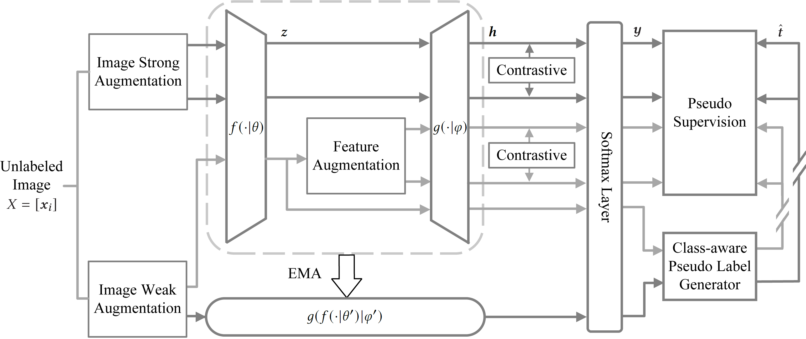

# DSSN
Semi-supervised semantic segmentation (SSS) is an important task that utilizes both labeled and unlabeled data to reduce expenses on labeling training examples. However, the effectiveness of SSS algorithms is limited by the difficulty of fully exploiting the potential of unlabeled data. To address this, we propose a dual-level Siamese structure network (DSSN) for pixel-wise contrastive learning. By aligning positive pairs with a pixel-wise contrastive loss using strong augmented views in both low-level image space and high-level feature space, the proposed DSSN is designed to maximize the utilization of available unlabeled data. Additionally, we introduce a novel class-aware pseudo-label selection strategy for weak-to-strong supervision, which addresses the limitations of most existing methods that do not perform selection or apply a predefined threshold for all classes. Specifically, our strategy selects the top high-confidence prediction of the weak view for each class to generate pseudo labels that supervise the strong augmented views. This strategy is capable of taking into account the class imbalance and improving the performance of long-tailed classes. Our proposed method achieves state-of-the-art results on two datasets, PASCAL VOC 2012 and Cityscapes, outperforming other SSS algorithms by a significant margin.

<p align="left">

</p>


## Getting Started

### Installation

#### Pascal VOC
```sh
pip install -r env181.txt
```

####  Cityscapes
```sh
pip install -r env200.txt
```

Parts of this code are borrowed from the baseline [ST++](https://github.com/LiheYoung/ST-PlusPlus)

### Pretrained Backbone

[ResNet-50](https://drive.google.com/file/d/1mqUrqFvTQ0k5QEotk4oiOFyP6B9dVZXS/view?usp=sharing) | [ResNet-101](https://drive.google.com/file/d/1Rx0legsMolCWENpfvE2jUScT3ogalMO8/view?usp=sharing) | [Xception-65](https://drive.google.com/open?id=1_j_mE07tiV24xXOJw4XDze0-a0NAhNVi)

```
├── ./pretrained
    ├── resnet50.pth
    ├── resnet101.pth
    └── xception.pth
```

### Dataset

- Pascal: [JPEGImages](http://host.robots.ox.ac.uk/pascal/VOC/voc2012/VOCtrainval_11-May-2012.tar) | [SegmentationClass](https://drive.google.com/file/d/1ikrDlsai5QSf2GiSUR3f8PZUzyTubcuF/view?usp=sharing)
- Cityscapes: [leftImg8bit](https://www.cityscapes-dataset.com/file-handling/?packageID=3) | [gtFine](https://drive.google.com/file/d/1E_27g9tuHm6baBqcA7jct_jqcGA89QPm/view?usp=sharing)
- COCO: [train2017](http://images.cocodataset.org/zips/train2017.zip) | [val2017](http://images.cocodataset.org/zips/val2017.zip) | [masks](https://drive.google.com/file/d/166xLerzEEIbU7Mt1UGut-3-VN41FMUb1/view?usp=sharing)

Please modify your dataset path in configuration files.

**The groundtruth masks have already been pre-processed by us. You can use them directly.**

```sh
├── [Your Pascal Path]
    ├── JPEGImages
    └── SegmentationClass
    
├── [Your Cityscapes Path]
    ├── leftImg8bit
    └── gtFine
    
├── [Your COCO Path]
    ├── train2017
    ├── val2017
    └── masks
```

## Usage

### DSSN

```bash
# use torch.distributed.launch
sh scripts/train.sh <num_gpu> <port>

# or use slurm
# sh scripts/slurm_train.sh <num_gpu> <port> <partition>
```

To train on other datasets or splits, please modify
``dataset`` and ``split`` in [train.sh](https://github.com/kunzhan/DSSN/blob/main/voc/scripts/train.sh).


### Supervised Baseline

Modify the ``method`` from ``'DSSN'`` to ``'supervised'`` in [train.sh](https://github.com/kunzhan/DSSN/blob/main/voc/scripts/train.sh), and double the ``batch_size`` in configuration file if you use the same number of GPUs as semi-supervised setting (no need to change ``lr``). 


## Citation

If you find this project useful, please consider citing:

```bibtex
@InProceedings{DSSN2023,
  author    = {Tian, Zhibo and Zhang, Xiaolin and Zhang, Peng and Zhan, Kun},
  booktitle = {ACM Multimedia},
  title     = {Improving semi-supervised semantic segmentation with dual-level Siamese structure network},
  year      = {2023},
}
```